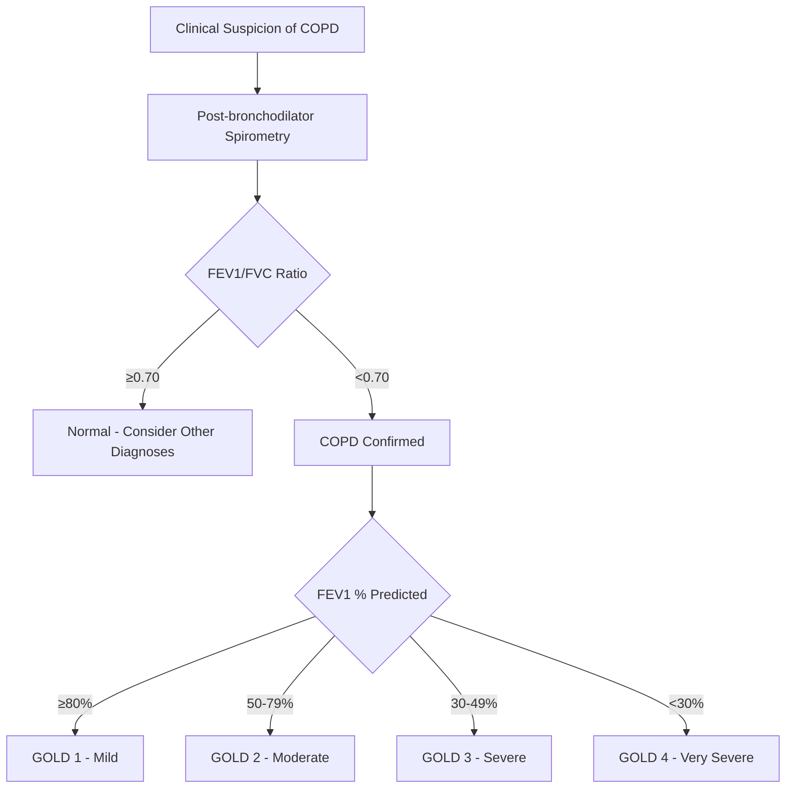
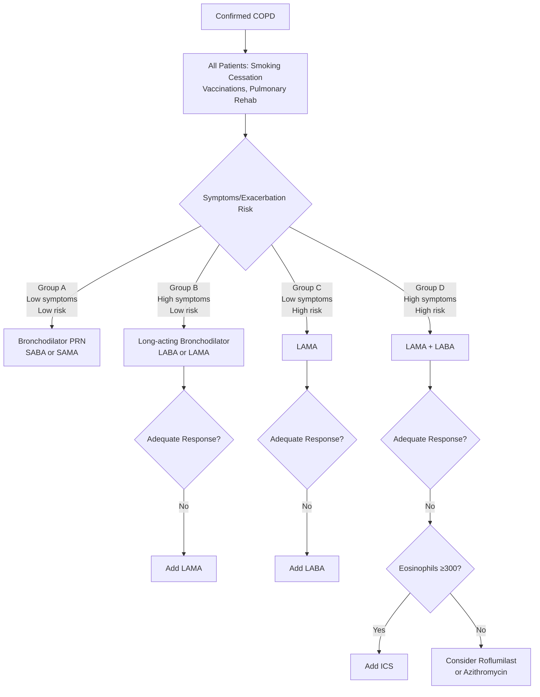
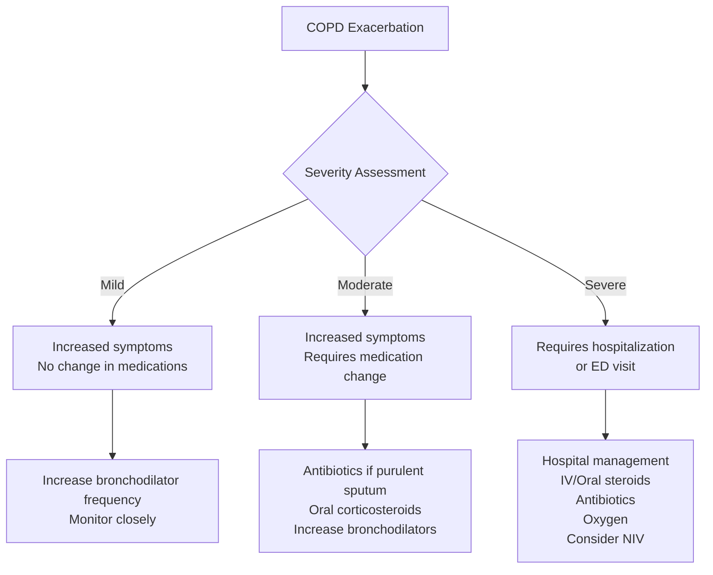

# Chronic Obstructive Pulmonary Disease (COPD)

## Overview
COPD is a preventable and treatable disease characterized by persistent respiratory symptoms and airflow limitation due to airway and/or alveolar abnormalities, usually caused by significant exposure to noxious particles or gases.

## Key Information
- **ICD-10 Code**: J44.1 (COPD with acute exacerbation), J44.0 (COPD with acute lower respiratory infection)
- **Prevalence**: ~16 million diagnosed in US, estimated 30 million affected
- **Age of Onset**: Typically >40 years with 20+ pack-year smoking history
- **Leading Cause**: Tobacco smoke (85-90% of cases)

## Pathophysiology
- **Chronic Bronchitis**: Mucus hypersecretion, airway inflammation
- **Emphysema**: Alveolar destruction, loss of elastic recoil
- **Small Airway Disease**: Airway narrowing, increased resistance
- **Systemic Inflammation**: Cardiovascular and musculoskeletal effects

## Clinical Presentation

### Symptoms
- **Progressive dyspnea**: Initially on exertion, eventually at rest
- **Chronic cough**: Often productive, worse in mornings
- **Sputum production**: Clear to purulent
- **Wheezing**: Especially during exacerbations
- **Chest tightness**
- **Fatigue and weakness**
- **Weight loss** (advanced disease)

### Physical Findings
- **Inspection**: Barrel chest, pursed-lip breathing, use of accessory muscles
- **Palpation**: Decreased tactile fremitus
- **Percussion**: Hyperresonance, decreased diaphragmatic excursion
- **Auscultation**: Decreased breath sounds, prolonged expiration, wheezes, rhonchi

## Diagnostic Evaluation

### Spirometry (Essential for Diagnosis)

### Additional Testing
- **Chest X-ray**: Rule out other pathology, assess hyperinflation
- **CT Chest**: If surgical evaluation needed, assess emphysema distribution
- **Arterial Blood Gas**: If severe disease or acute exacerbation
- **Alpha-1 Antitrypsin Level**: If early onset or family history
- **6-Minute Walk Test**: Assess functional capacity

### COPD Assessment Test (CAT)
- Standardized questionnaire (0-40 points)
- Assesses impact on daily life
- <10: Low impact, 10-20: Medium impact, 21-30: High impact, >30: Very high impact

## Treatment Algorithm

## Management

### Non-Pharmacological Management

#### Smoking Cessation (Most Important)
- **Counseling**: Brief intervention at every visit
- **Pharmacotherapy**:
  - Nicotine replacement therapy
  - Bupropion: 150mg twice daily
  - Varenicline: 0.5mg daily × 3 days, then 0.5mg twice daily × 4 days, then 1mg twice daily
- **Behavioral Support**: Quitlines, support groups

#### Pulmonary Rehabilitation
- **Exercise Training**: Aerobic and strength training
- **Education**: Disease management, inhaler technique
- **Nutritional Counseling**
- **Psychosocial Support**
- Duration: 6-8 weeks minimum

#### Vaccinations
- **Influenza**: Annual vaccination
- **Pneumococcal**: PPSV23 and PCV13 per guidelines
- **COVID-19**: Per current recommendations

### Pharmacological Management

#### Short-Acting Bronchodilators (Rescue)
- **SABA**: Albuterol 2-4 puffs every 4-6 hours PRN
- **SAMA**: Ipratropium 2-4 puffs every 6 hours PRN

#### Long-Acting Bronchodilators

**LABA (Long-Acting Beta Agonists)**
- Formoterol: 12 mcg twice daily
- Salmeterol: 50 mcg twice daily
- Indacaterol: 75 mcg daily

**LAMA (Long-Acting Muscarinic Antagonists)**
- Tiotropium: 18 mcg daily
- Umeclidinium: 62.5 mcg daily
- Glycopyrronium: 50 mcg daily

**Combination LABA/LAMA**
- Formoterol/Glycopyrronium (Bevespi)
- Vilanterol/Umeclidinium (Anoro)

#### Inhaled Corticosteroids (ICS)
- **Indications**: Eosinophils ≥300, history of asthma, frequent exacerbations
- **Agents**: Fluticasone, Budesonide
- **Combinations**: ICS/LABA, Triple therapy (ICS/LABA/LAMA)

#### Other Medications
- **Roflumilast**: 500 mcg daily (severe COPD with chronic bronchitis)
- **Azithromycin**: 250 mg daily or 500 mg three times weekly (prevent exacerbations)
- **Oxygen Therapy**: If resting SpO2 ≤88% or PaO2 ≤55 mmHg

### Oxygen Therapy
- **Continuous**: 15+ hours daily if resting hypoxemia
- **Nocturnal**: If sleep-related hypoxemia
- **Exertional**: If significant desaturation with activity
- **Target**: Maintain SpO2 88-92%

## Exacerbation Management

### Assessment of Severity

### Treatment
- **Bronchodilators**: Increase frequency, add ipratropium/albuterol combination
- **Corticosteroids**: Prednisone 40mg daily × 5 days
- **Antibiotics**: If purulent sputum or increased dyspnea
  - Azithromycin, doxycycline, amoxicillin-clavulanate
- **Oxygen**: Maintain SpO2 88-92%

### Hospitalization Criteria
- Severe symptoms unresponsive to outpatient treatment
- New or worsening hypoxemia
- New or worsening hypercapnia
- Hemodynamic instability
- Inability to manage at home

## Complications

### Respiratory
- **Acute respiratory failure**: Hypoxemic or hypercapnic
- **Pneumonia**: Increased susceptibility
- **Pneumothorax**: Especially with emphysema
- **Pulmonary hypertension**: Right heart strain

### Cardiovascular
- **Cor pulmonale**: Right-sided heart failure
- **Arrhythmias**: Atrial fibrillation, ventricular arrhythmias
- **Increased MI risk**: Systemic inflammation

### Systemic
- **Weight loss/Cachexia**: Poor prognosis indicator
- **Osteoporosis**: Especially with steroid use
- **Depression/Anxiety**: Common comorbidities
- **Sleep disorders**: Sleep apnea, hypoventilation

## Prognosis and Monitoring

### Prognostic Factors
- **FEV1**: Lower values indicate worse prognosis
- **Exacerbation frequency**: >2 per year increases mortality
- **Exercise capacity**: 6-minute walk distance
- **Comorbidities**: Cardiovascular disease, cancer
- **BMI**: Both low and high BMI associated with worse outcomes

### Regular Monitoring
- **Spirometry**: Annually or if symptoms worsen
- **Symptom assessment**: CAT score, mMRC dyspnea scale
- **Exacerbation frequency**: Track patterns
- **Inhaler technique**: Review at each visit
- **Comorbidities**: Screen for cardiovascular disease, osteoporosis

## Related Conditions
- [Asthma](asthma.md) - Asthma-COPD Overlap (ACO)
- [Heart Failure](heart-failure.md) - Common comorbidity
- [Sleep Apnea](sleep-apnea.md) - Overlap syndrome
- [Lung Cancer](lung-cancer.md) - Shared risk factors
- [Pulmonary Hypertension](pulmonary-hypertension.md)

## Key References
- [GOLD 2024 Guidelines](https://goldcopd.org/2024-gold-report/)
- [ATS/ERS COPD Guidelines](https://www.atsjournals.org/doi/full/10.1164/rccm.201204-0596ST)
- [TORCH Trial](https://www.nejm.org/doi/full/10.1056/NEJMoa070928)
- [ECLIPSE Study](https://www.atsjournals.org/doi/full/10.1164/rccm.200909-1384OC)

## Recent Updates
- **2024**: Updated GOLD guidelines with revised treatment algorithms
- **2023**: New data on triple therapy efficacy
- **2022**: Updated vaccination recommendations

---
*Last updated: [Date] by [Physician Name]*
*Next review: [Date]*
