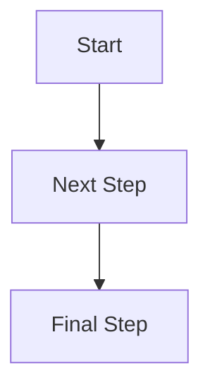

# How to Edit This Wiki - Simple Guide

## Making Changes to Existing Pages

1. **Find the page you want to edit**
   - Navigate to the file in the repository
   - Example: `docs/diabetes-type-2.md`

2. **Click the pencil icon** (top right of file)

3. **Make your changes**
   - Edit the text directly
   - Use simple formatting (see below)

4. **Save your changes**
   - Scroll to bottom
   - Add brief description: "Updated diabetes medication dosages"
   - Click "Commit changes"

5. **Wait 2-3 minutes** - the website updates automatically

## Adding New Disease Pages

1. **Go to the diseases folder**: `docs/diseases/`
2. **Click "Add file" → "Create new file"**
3. **Name it**: `new-disease-name.md`
4. **Copy structure from existing disease** (like diabetes-type-2.md)
5. **Fill in the information**
6. **Commit the file**
7. **Update the navigation** in `mkdocs.yml` (ask for help with this)

## Simple Formatting

### Text Formatting
- `**Bold text**` makes **bold text**
- `*Italic text*` makes *italic text*
- `## Large Heading` makes a large heading
- `### Smaller Heading` makes a smaller heading

### Lists
```
- First item
- Second item
- Third item
```

### Links
- To other pages: `[Hypertension](hypertension.md)`
- To external sites: `[PubMed](https://pubmed.ncbi.nlm.nih.gov/)`

### Simple Flowcharts


## Common Mistakes to Avoid

- Don't delete the file headers (the stuff at the top)
- Don't change file names without updating links
- Test any complex changes in small steps
- Ask for help with navigation changes

## Need Help?

Contact [Your Name] at [Your Email] for any technical issues.
